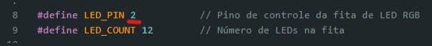
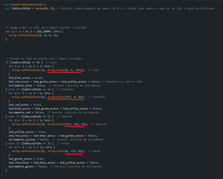
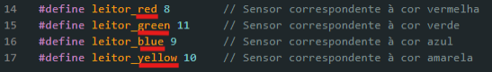
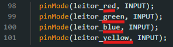
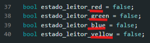
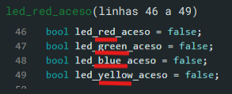
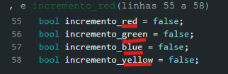
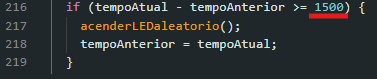

# Cata Bomba

Cata Bomba é uma lixeira interativa que transforma o ato de descartar lixo corretamente em uma experiência divertida e educativa, quase como um jogo. A seguir, iremos mostrar as funcionalidades do código e como manuseá-lo.

---
## Como funciona:
- O Cata Bomba é um sistema de lixeira gamificada composto por quatro compartimentos, cada um equipado com um sensor específico. O objetivo principal do dispositivo é promover o descarte correto do lixo, utilizando uma abordagem interativa e educativa.

- Cada compartimento é indicado por um sistema de LEDs que sinaliza o local correto para o descarte. Ao acertar o compartimento indicado, o usuário acumula pontos, enquanto um display exibe a pontuação atual e o recorde alcançado. No entanto, caso o lixo seja descartado no compartimento incorreto, a pontuação atual será zerada, mantendo-se apenas o registro da maior pontuação obtida até então.

- Esse sistema combina tecnologia e gamificação para estimular práticas sustentáveis de maneira divertida e envolvente.
---

## Como utilizar o código:

### Como Baixar a IDE Arduino:
- **[Clique Aqui](https://docs.arduino.cc/software/ide-v1/tutorials/Windows/)**
### Bibliotecas necessárias e como instalar:
- **LiquidCrystal I2C**
- **Adafruit NeoPixel**
- **Como instalar as bibliotecas:** Abra a IDE do arduino, clique na aba que possui ícone de livros e escreva a biblioteca que deseja instalar na barra de pesquisas, depois clique em instalar. Para mais informações **[Clique Aqui](https://www.robocore.net/tutoriais/adicionando-bibliotecas-na-ide-arduino?gad_source=1&gclid=CjwKCAiAxqC6BhBcEiwAlXp4567KJd8nIaT3qUpsr2lFPX3wXANIXrYDnvhXDLUpxOHrhjh1_6waexoCZAsQAvD_BwE)**

---

### Componentes que podem ser alterados e como:

#### 1. **Localização dos pinos**
   - Para modificar a localização dos pinos, altere no Arduino e substitua no código (exemplo: linha 8).
   

#### 2. **Cores dos LEDs**
   - Para alterar as cores dos LEDs, modifique os valores dentro da função `acenderLEDaleatorio()` (linhas 129 até 179).
   - Cada cor é representada por uma combinação específica de três valores, correspondentes aos componentes RGB (Vermelho, Verde e Azul). 
   - Pesquise os códigos das cores desejadas e substitua os valores dentro da função `strip.Color()`.

   - 
#### 3. **Associação das cores a sensores e variáveis**
  - Você pode alterar os números associados as cores, caso precise alterar a porta digital ligada ao sensor infravermelho.
 
   - Exemplo: A cor vermelha está associada a várias variáveis, como:
     - `leitor_red` (linhas 14 até 17)

       
     - `estado_leitor_red` (linhas 36 até 40)

       
     - `led_red_aceso` (linhas 46 a 49)

       
     - `incremento_red` (linhas 55 a 58)

       
   - Caso altere o nome de alguma variável, atualize todas as instâncias citadas no código. Recomenda-se usar nomes que reflitam claramente as cores às quais as variáveis se referem, para facilitar a manutenção e compreensão do código.

#### 4. **Tempo que os LEDs ficam acesos**
   - Por padrão, os LEDs ficam acesos por 1.5 segundos. Para alterar esse intervalo, modifique o valor dentro da condição `if (tempoAtual - tempoAnterior >= 1500)` (linha 216).

     

--- 

